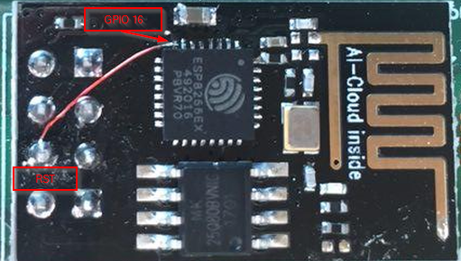
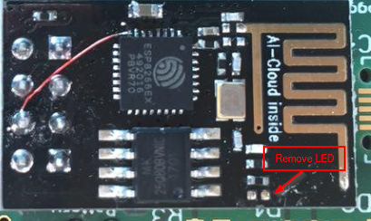
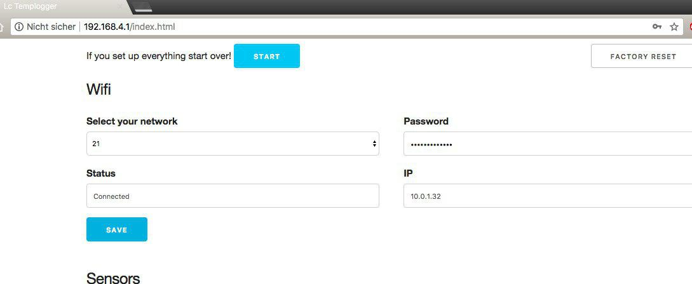
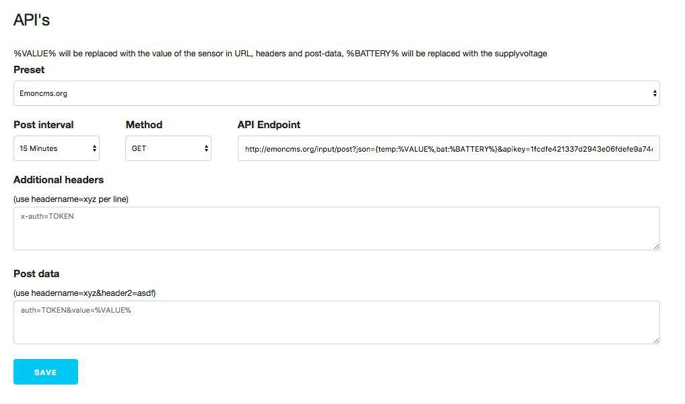
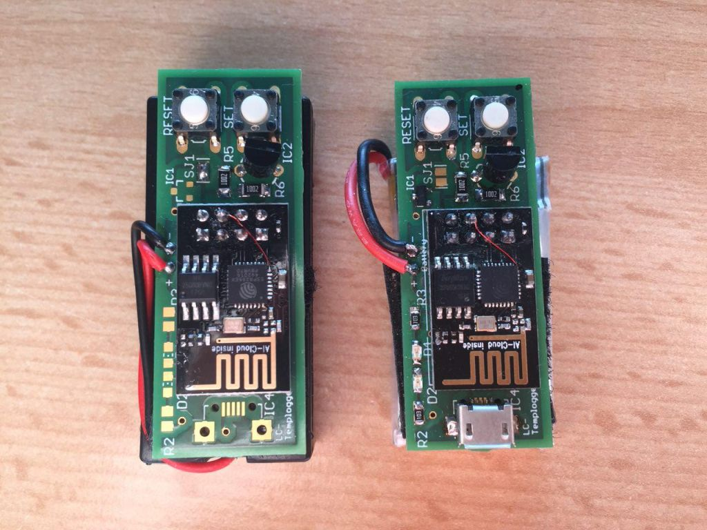

# lcTempLogger
lcTemplogger is a simple ESP8266 temperature-logger using the DS18B22 onewire sensors to feed iot-databases like emoncms / thinkspeak / etc.
You can flash the software onto the ESP8266 without editing the code, setting up the wifi is done via a webinterface.

## Sleep mode
the used ESP8266-01 requires the GPIO 16 wired to RST to wake up from deepsleep mode. if you don't do this the ESP will 
never wake up on itself.

## Powersaving
To not drain the batteries too much, the ESP will shutdown after 5 minutes of inactivity in configuration mode, you can simply wake it up again by pressing the reset button.

I suggest to remove the red power-led from the board. This can be done using a soldering iron or just break it out carefully.

## Building
Building and flashing is done via the Arduino-IDE

add the ESP to your IDE following this guide 
https://github.com/esp8266/Arduino#installing-with-boards-manager

All other required libraries like onewire and the DS18B22 are included into the sketch. Go to arduino/lcTempLogger/ and open lcTempLogger.ino and hit the uploadbutton

Settings
* Board "Generic ESP8266 Module"
* Flash Mode "DIO"
* Flash Frequency "40MHz"
* CPU Frequency "80MHz"
* Flash Size "1M (512k SPIFFS)"
* Debug port "Disabled"
* Debug Level "None"
* Reset Method "ck"
* Upload Speed "115200"

#### uploading the sketchdata
Use the [esp8266fs-plugin](https://github.com/esp8266/arduino-esp8266fs-plugin) to upload the data into the spiffs.

After including the plugin into the IDE you can simply hit tool->ESP8266 Sketch Data Upload 

## Configuring
If done everything correctly you should be able to find a wifi called "LC-ESP8266-XXXXXXXX",
 connect to it with the password "12345678" (yes, i know it is insecure, but the wifi will be on for configuration only) 
and open 192.168.1.4 in a webbrowser. Select your Network, enter the password and hit "Save" after waiting a bit 
(the ESP is sometimes slow with connecting) until the Wifistatus changes to "connected".

#### API's
Under "API's" you are able to select a preset for emoncms or thinkspeak, just replace your apikey with the placesholder.
I you want to use another API just add the URL, the method (Post or Get) and set the headers and Postdata.
Hit save and try making a testcall under "Test API", you will see the response in the textbox below the testbutton.

If everything works go to the top of the page and hit "Start" to set the ESP to deepsleep.

#### Aborting deepsleep
if you want to wake up the ESP to change settings like API, wifi or whatever press the reset-button, after that you have 2 seconds 
to press the "Set" button once and the ESP will wake up with the accesspoint enabled for configuring. (You need to start the deepsleep again via the webinterface)

## Boards
the board is designed to work with normal AAA-batteries or a 3.7V Lipo including a simple charging circuit using the TP4056 and a MCP1700 as voltageregulator.
You can find the eagle-files in eagle/ (eagle version 7.5)
Boards can be easily ordered at [aisler.net](https://aisler.net/littleCdev/my-project-repository/esp8266-templogger)

Example boards from aisler, left: AAA-battery powered, right using a 3.7V 500mAh lipo battery with charger

>For AAA-battery powered boards set SJ1 and **don't** place following components 
* IC1 
* IC3
* R1
* R2
* R3
* D1
* D2

# Licence MIT
Copyright 2017 Matthias Böck

Permission is hereby granted, free of charge, to any person obtaining a copy of this software and associated documentation files (the "Software"), to deal in the Software without restriction, including without limitation the rights to use, copy, modify, merge, publish, distribute, sublicense, and/or sell copies of the Software, and to permit persons to whom the Software is furnished to do so, subject to the following conditions:

The above copyright notice and this permission notice shall be included in all copies or substantial portions of the Software.

THE SOFTWARE IS PROVIDED "AS IS", WITHOUT WARRANTY OF ANY KIND, EXPRESS OR IMPLIED, INCLUDING BUT NOT LIMITED TO THE WARRANTIES OF MERCHANTABILITY, FITNESS FOR A PARTICULAR PURPOSE AND NONINFRINGEMENT. IN NO EVENT SHALL THE AUTHORS OR COPYRIGHT HOLDERS BE LIABLE FOR ANY CLAIM, DAMAGES OR OTHER LIABILITY, WHETHER IN AN ACTION OF CONTRACT, TORT OR OTHERWISE, ARISING FROM, OUT OF OR IN CONNECTION WITH THE SOFTWARE OR THE USE OR OTHER DEALINGS IN THE SOFTWARE.